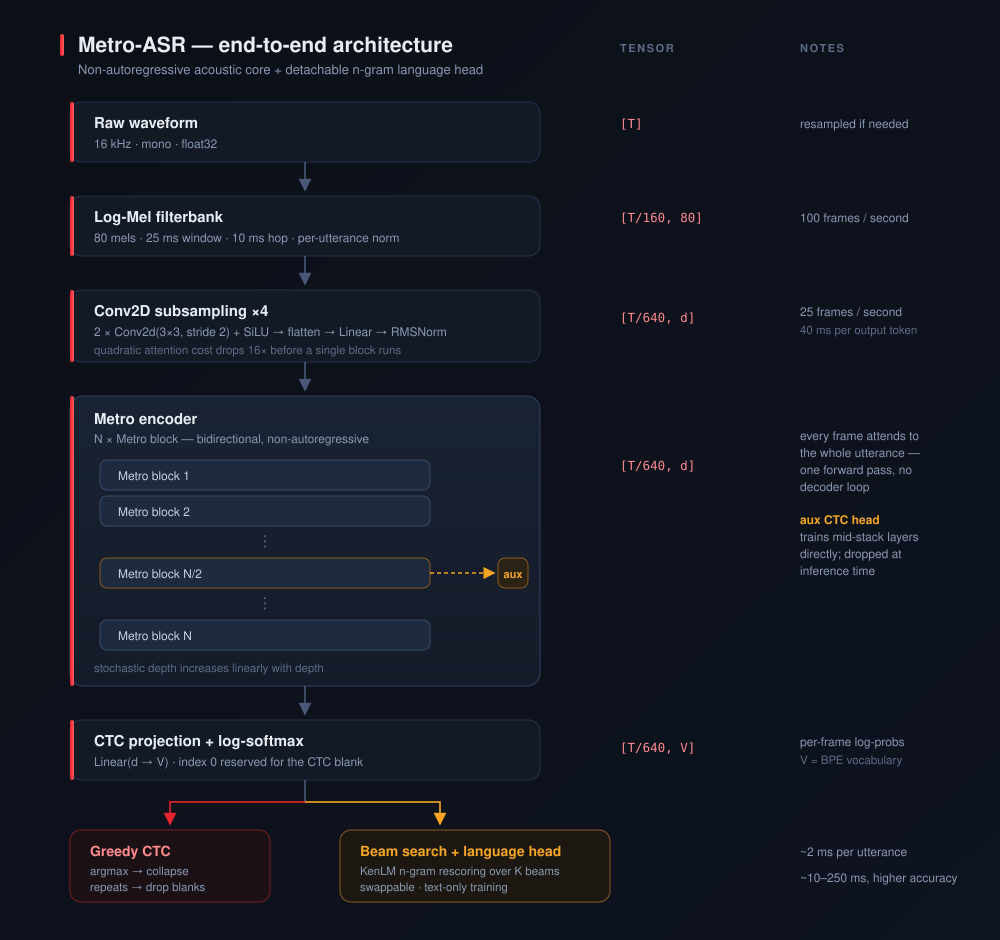
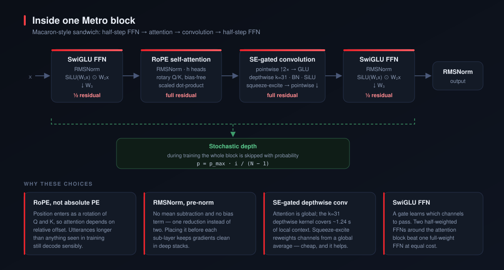
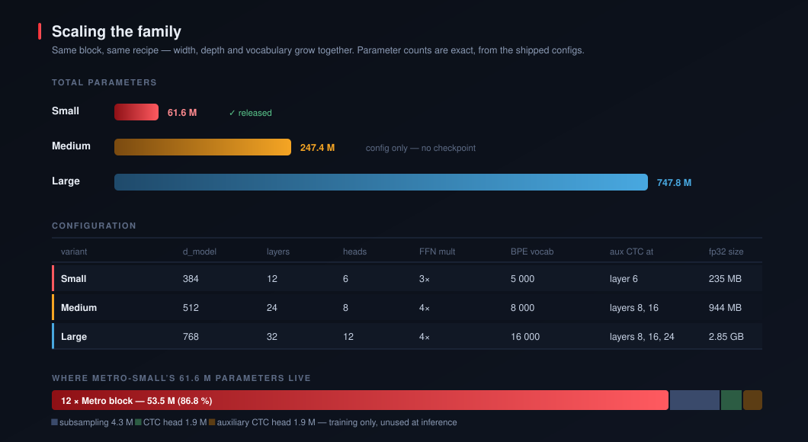
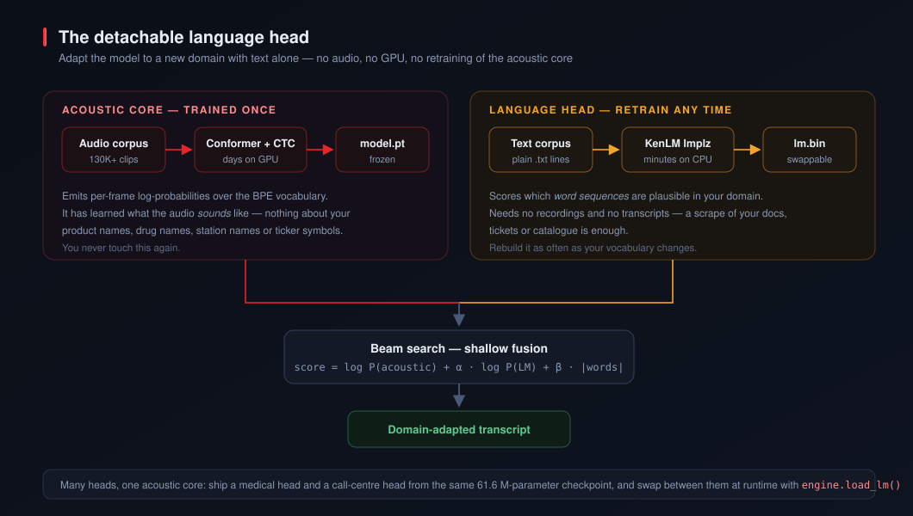
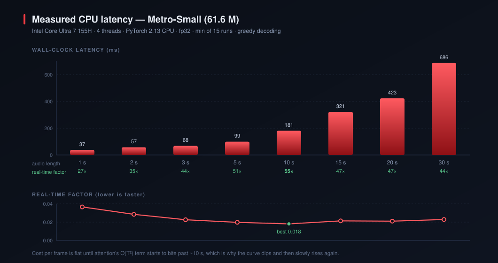
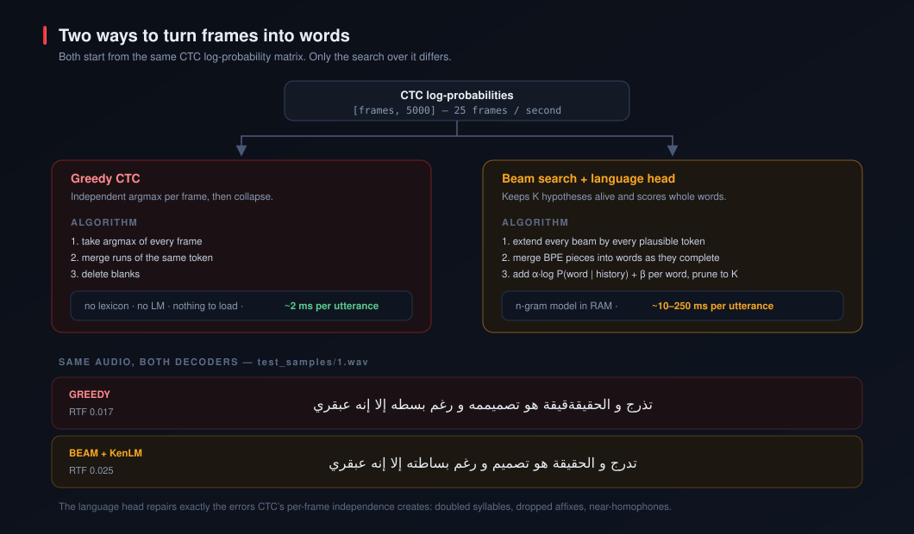
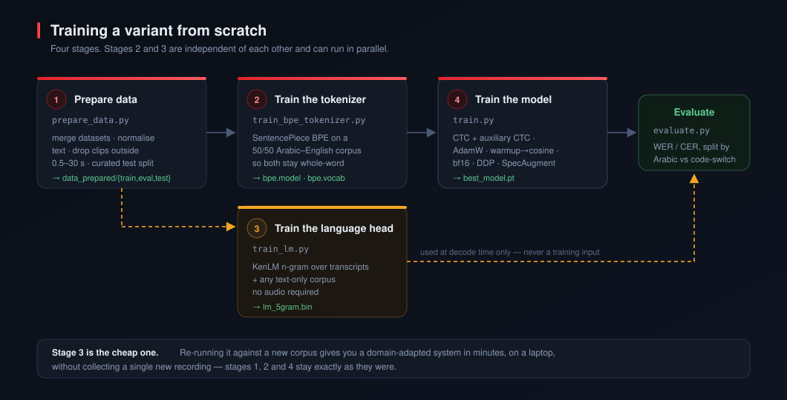

<p align="center">
  
</p>

<h1 align="center">Metro-ASR</h1>

<p align="center">
  <strong>A non-autoregressive speech recogniser for Egyptian Arabic and Arabic–English code-switching,<br>
  with a detachable n-gram language head you can retrain on text alone.</strong>
</p>

<p align="center">
  <a href="https://pypi.org/project/metro-asr/"></a>
  <a href="https://huggingface.co/MohammedAly22"></a>
  <a href="https://mohammedaly22.github.io/metro-asr/"></a>
  
  
  
</p>

---

## Abstract

Most speech recognisers that handle a dialect well handle it by memorising it. Metro-ASR separates the
two things a recogniser has to know — **what the audio sounds like** and **what the words are likely to
be** — into two artefacts that are trained separately and shipped separately.

The acoustic side is a Conformer-style encoder trained with CTC. It is non-autoregressive: one forward
pass turns an utterance into a matrix of per-frame log-probabilities, with no decoder loop, no beam
over time steps, and no dependence on previously emitted tokens. That is what makes it fast on a CPU.

The language side is an n-gram model. It never sees audio. You build it from plain text with a single
command, it plugs into the decoder at run time, and you can swap it for a different one — a medical
vocabulary, a call-centre vocabulary, your product catalogue — without retraining, or even reloading,
the acoustic model.

The released checkpoint, **Metro-Small (61.6 M parameters)**, transcribes 122 seconds of real Egyptian
Arabic in **2.1 seconds on four CPU threads**. No GPU is involved anywhere in this README's inference
examples.

To show that the separation is real rather than rhetorical, this repository ships three
interchangeable language heads — general, technical and medical — and measures all of them against
human references on the same eleven clips. The technical head cuts word error on technical speech by
**31 % relative to greedy** while the acoustic weights never change. It also makes general speech
*worse*, which is the honest other half of the result. See
**[Demo clips and results](#demo-clips-and-results)** and the
**[interactive report](docs/index.html)**.

<p align="center">
  
</p>

---

## Architecture

### Why non-autoregressive

An autoregressive recogniser emits token *t* only after it has emitted token *t−1*. For a 30-second
utterance that is a few hundred sequential neural network calls, each of which must finish before the
next begins. Latency is bounded by the length of the transcript, and none of it parallelises.

A CTC model makes a different bargain. It emits a distribution over the vocabulary **independently for
every acoustic frame**, and defines the probability of a transcript as the sum over all frame-level
alignments that collapse to it:

```
P(y | x) = Σ            Π  P(a_t | x)
        a ∈ B⁻¹(y)      t
```

where `B` deletes blanks and merges repeats. The independence assumption is a real cost in accuracy —
nothing stops the model from writing `الحقيقةقيقة` when two adjacent frames both want to start the
same syllable. But it buys a decisive property: **every frame is computed at once**. One matrix
multiply per layer covers the whole utterance. That is the entire reason a 61.6 M-parameter model runs
at 55× real time on a laptop CPU.

The [language head](#the-language-head) exists to buy the accuracy back.

### The block

Twelve identical blocks make up Metro-Small's encoder. Each is a Macaron sandwich — two half-weighted
feed-forward networks wrapped around an attention module and a convolution module:

<p align="center">
  
</p>

Attention gives every frame a view of the entire utterance. Convolution gives it a sharp view of its
immediate neighbourhood. Speech needs both: phoneme identity is local, but speaker rate, prosody and
disambiguation between similar words are not.

| Component                  | What it is                                                                                      | Why                                                                                                                                                     |
| -------------------------- | ----------------------------------------------------------------------------------------------- | ------------------------------------------------------------------------------------------------------------------------------------------------------- |
| **RoPE attention**   | Rotary position embeddings applied to Q and K; bias-free projections                            | Attention scores depend on*relative* offset, so nothing breaks on utterances longer than any seen in training                                         |
| **SwiGLU FFN**       | `W₃(SiLU(W₁x) ⊙ W₂x)`, expansion 3×, applied twice at half weight                        | A learned gate decides which channels pass; two half-steps outperform one full-step at equal parameter count                                            |
| **RMSNorm**          | `x / √(mean(x²) + ε) · γ`, pre-norm                                                      | One reduction instead of LayerNorm's two, no mean and no bias term; pre-norm keeps gradients well-behaved as depth grows                                |
| **SE-gated conv**    | Pointwise ↑2× → GLU → depthwise k=31 → BatchNorm → SiLU → squeeze-excite → pointwise ↓ | The depthwise kernel spans 31 frames ≈**1.24 s** of audio. Squeeze-excite reweights channels from a global average — negligible cost, real gain |
| **Stochastic depth** | Block skipped with probability`p_max · i/(N−1)` during training                             | Deeper layers are dropped more often, which regularises the stack and shortens the effective gradient path                                              |
| **Auxiliary CTC**    | A second CTC head at layer 6, loss weight 0.3                                                   | Mid-stack layers receive gradient directly instead of only through eleven more blocks. Discarded at inference                                           |

### From waveform to frames

The frame rate matters more than any other single number here, so it is worth following explicitly:

| Stage                                                | Rate      | Shape for a 10 s clip |
| ---------------------------------------------------- | --------- | --------------------- |
| Waveform, 16 kHz mono                                | 16 000 Hz | `[160 000]`         |
| Log-Mel, 80 filters, 25 ms window / 10 ms hop        | 100 fps   | `[1 001, 80]`       |
| Conv2d(3×3, s2) ×2 → flatten → Linear → RMSNorm | 25 fps    | `[251, 384]`        |
| Encoder (12 blocks)                                  | 25 fps    | `[251, 384]`        |
| CTC projection + log-softmax                         | 25 fps    | `[251, 5 000]`      |

Subsampling by 4 before the first block cuts attention's quadratic term by **16×**. One output token
covers 40 ms of audio, which comfortably exceeds the rate at which anyone speaks — the model has room
to emit a blank between every real token, which is exactly what CTC needs.

> [!NOTE]
> The maximum transcript length is bounded by the number of output frames. A 0.5 s clip yields 13
> frames and cannot represent a transcript longer than about 6 BPE tokens. The training loop detects
> and skips these instead of feeding CTC an impossible target.

### Tokenizer

A SentencePiece BPE vocabulary of 5 000, trained on a deliberately balanced Arabic/English corpus.
Balance is the point: a vocabulary fit mostly to Arabic shreds English words into single characters,
and a CTC model that must emit `d-o-w-n-l-o-a-d` one letter at a time is far more fragile than one
emitting `▁download`.

Measured composition of the released `bpe.model`:

| Piece type                                    | Count           | Word-initial (`▁` prefix) |
| --------------------------------------------- | --------------- | ---------------------------- |
| Arabic                                        | 3 246           | 1 994                        |
| Latin                                         | 1 698           | 987                          |
| Digits, punctuation, other                    | 53              | —                           |
| **SentencePiece total**                 | **4 997** |                              |
| **+ `<blank>`, `<unk>`, `<pad>`** | **5 000** |                              |

Index 0 is reserved for the CTC blank, so every SentencePiece id is shifted by 3.

### Where the parameters live

<p align="center">
  
</p>

| Component                           |           Parameters |  Share |
| ----------------------------------- | -------------------: | -----: |
| 12 × Metro block                   |           53 455 104 | 86.8 % |
| Conv subsampling                    |            4 281 216 |  7.0 % |
| CTC head                            |            1 925 000 |  3.1 % |
| Auxiliary CTC head*(training only)* |            1 925 000 |  3.1 % |
| **Total**                     | **61 586 320** |        |

At inference the auxiliary head is loaded but never called, so the effective compute path is 59.7 M
parameters.

---

## The language head

This is the part of Metro-ASR worth stealing.

<p align="center">
  
</p>

CTC's per-frame independence produces a specific, recognisable class of error: doubled syllables,
dropped affixes, near-homophones, English words half-spelled. These are not acoustic failures. The
model heard correctly and wrote something that is not a word.

A word-level n-gram model fixes them, because it knows which *sequences* are plausible. During beam
search, when a run of BPE pieces completes a word, the decoder adds the language model's opinion of it:

```
score(beam) = log P(acoustic)  +  α · log P(word | history)  +  β · |words|
```

`α` weights how much you trust the language model. `β` is a per-word bonus that counteracts the fact
that inserting fewer words always scores better under a probability model — without it, the decoder
quietly deletes things, and English words are usually the first to go.

### What makes it detachable

The n-gram model is a separate file. It is not a layer, it has no learned interaction with the encoder,
and nothing about the acoustic model changes when you replace it. Concretely:

|                       | Acoustic core              | Language head                  |
| --------------------- | -------------------------- | ------------------------------ |
| Training input        | paired audio + transcripts | **plain text, no audio** |
| Hardware              | GPU, days                  | CPU, minutes                   |
| Rebuilt when          | you have new recordings    | your vocabulary changes        |
| Artefact              | `model.pt`               | `lm_5gram.bin`               |
| Swappable at run time | no                         | **yes**                  |

So if your system needs to recognise 400 pharmaceutical brand names it has never heard, you do not need
recordings of those names. You need a text file containing them in context, and about ten minutes:

```python
from metro_asr import MetroASREngine

engine = MetroASREngine.from_pretrained("small")

engine.load_lm("lm/general_5gram.bin")
print(engine.transcribe("call.wav", beam_search=True).text)

engine.load_lm("lm/pharma_5gram.bin")      # same weights, different vocabulary
print(engine.transcribe("call.wav", beam_search=True).text)
```

Recipe for building one: [Training a language head only](#training-a-language-head-only).

### Tuning α and β

| Parameter         | Range       | Raise it when                               | Lower it when                          |
| ----------------- | ----------- | ------------------------------------------- | -------------------------------------- |
| `beam_width`    | 10 – 500   | you can afford latency                      | you cannot                             |
| `lm_alpha` (α) | 0.0 – 3.0  | output is not valid Arabic                  | the LM overrides what was clearly said |
| `lm_beta` (β)  | 0.0 – 10.0 | words are being deleted, especially English | words are being hallucinated           |

Defaults are `beam_width=100`, `α=0.5`, `β=5.0`. Sweep them on your own data with
`TUNE_MODE = True` in [scripts/inference.py](scripts/inference.py).

> [!TIP]
> The single most common complaint — *"it drops my English words"* — is a `β` problem, not an `α`
> problem. Try `β = 5.0` to `8.0` before touching anything else.

---

## Model variants

Three sizes share one block definition, one training recipe and one data pipeline. Only width, depth
and vocabulary change.

|                        |  Params | d_model | Layers | Heads | FFN | BPE vocab | Aux CTC at |    fp32 | Status             |
| ---------------------- | ------: | ------: | -----: | ----: | --: | --------: | ---------- | ------: | ------------------ |
| **Metro-Small**  |  61.6 M |     384 |     12 |     6 | 3× |     5 000 | layer 6    |  235 MB | **Released** |
| **Metro-Medium** | 247.4 M |     512 |     24 |     8 | 4× |     8 000 | 8, 16      |  944 MB | Config only        |
| **Metro-Large**  | 747.8 M |     768 |     32 |    12 | 4× |    16 000 | 8, 16, 24  | 2.85 GB | Config only        |

Parameter counts are exact, computed from [configs/](configs/). Medium and Large ship as configurations
with no trained weights — see [Scaling to Medium and Large](#scaling-to-medium-and-large) for what
training them actually requires.

---

## Performance

<p align="center">
  
</p>

Measured on an **Intel Core Ultra 7 155H**, 4 threads, PyTorch 2.13 CPU build, fp32, minimum of 15 runs
after 3 warm-ups. Reproduce with the snippet in [Benchmarking](#benchmarking).

|          Audio | Features |  Encoder | Greedy decode |              Total |             RTF | Faster than real time |
| -------------: | -------: | -------: | ------------: | -----------------: | --------------: | --------------------: |
|            1 s |   0.6 ms |  35.9 ms |        0.2 ms |            36.6 ms |           0.037 |                  27× |
|            2 s |   0.6 ms |  56.2 ms |        0.3 ms |            57.1 ms |           0.029 |                  35× |
|            3 s |   0.6 ms |  66.9 ms |        0.4 ms |            67.9 ms |           0.023 |                  44× |
|            5 s |   0.7 ms |  97.6 ms |        0.7 ms |            99.0 ms |           0.020 |                  51× |
| **10 s** |   1.1 ms | 178.2 ms |        1.4 ms | **180.7 ms** | **0.018** |        **55×** |
|           15 s |   1.8 ms | 316.8 ms |        2.7 ms |           321.3 ms |           0.021 |                  47× |
|           20 s |   2.3 ms | 416.9 ms |        3.4 ms |           422.7 ms |           0.021 |                  47× |
|           30 s |   4.6 ms | 676.4 ms |        5.2 ms |           686.2 ms |           0.023 |                  44× |

Two things to read out of this table. Short clips are dominated by fixed per-call overhead, so RTF is
*worse* at 1 s than at 10 s — batching short utterances is worth it. And past ~10 s attention's O(T²)
term starts to show, which is why the curve bottoms out at 10 s and slowly climbs again.

On the seven real Egyptian Arabic clips in [test_samples/](test_samples/) — 122.4 s of audio in total:

| Decoder                     | Total wall clock |   RTF | Faster than real time |
| --------------------------- | ---------------: | ----: | --------------------: |
| Greedy                      |           2.09 s | 0.017 |                  58× |
| Beam (K=100) + KenLM 5-gram |           2.88 s | 0.024 |                  43× |

Loading the 5.9 GB KenLM binary takes about 3.4 s once at start-up and holds it resident. Decoding
overhead above greedy is 10–250 ms per utterance depending on length.

### Benchmarking

```python
import time, statistics, torch
from metro_asr import MetroASREngine

torch.set_num_threads(4)
engine = MetroASREngine.from_pretrained("small", device="cpu")

for _ in range(3):
    engine.transcribe("audio.wav")                       # warm up

runs = [engine.transcribe("audio.wav") for _ in range(15)]
best = min(runs, key=lambda r: r.rtf)
print(f"{best.duration:.1f}s audio  ->  RTF {best.rtf:.4f}  ({1/best.rtf:.0f}x real time)")
```

> [!IMPORTANT]
> Benchmark with a fixed thread count. PyTorch defaults to using every core, which on a hybrid
> big/little CPU produces numbers that swing by 3× between runs. Every figure above is at
> `torch.set_num_threads(4)`.

---

## Comparison

> Benchmarks against other Egyptian Arabic and code-switching systems have not been run yet.
> This section will be filled in once evaluation on a shared public test set is complete.

---

## Installation

Metro-ASR needs Python 3.9+ and works on CPU with no CUDA toolkit installed.

### From PyPI

```bash
pip install metro-asr                     # core: inference, greedy decoding
pip install "metro-asr[lm]"               # + KenLM beam search
pip install "metro-asr[server]"           # + Flask REST API
pip install "metro-asr[demo]"             # + Gradio web UI
pip install "metro-asr[train]"            # + datasets, wandb, jiwer, librosa
pip install "metro-asr[all]"              # everything except dev tools
```

For a CUDA build of PyTorch, install it from PyTorch's index *first*, then Metro-ASR:

```bash
pip install torch torchaudio --index-url https://download.pytorch.org/whl/cu121
pip install metro-asr
```

### From source

```bash
git clone https://github.com/MohammedAly22/metro-asr.git
cd Metro-ASR
pip install -e .                          # or: pip install -e ".[dev]"
```

### With conda

```bash
conda create -n metro-asr python=3.10 -y
conda activate metro-asr
pip install torch torchaudio --index-url https://download.pytorch.org/whl/cu121
pip install -e ".[train]"
```

### Installing KenLM

Beam search needs `pyctcdecode` and `kenlm`, both installed by the `[lm]` extra. `pyctcdecode` is a
pure-Python wheel; `kenlm` normally ships a prebuilt wheel, and falls back to compiling:

```bash
pip install "metro-asr[lm]"

# only if the kenlm wheel is unavailable for your platform:
sudo apt-get install -y build-essential cmake libboost-all-dev libeigen3-dev   # Debian/Ubuntu
pip install https://github.com/kpu/kenlm/archive/master.zip
```

That covers *using* a language head. **Training** one is where it usually gets awkward: KenLM's
`lmplz` and `build_binary` are command-line binaries that are not part of the Python package, and
building them on Windows is genuinely painful.

So [scripts/train_lm.py](scripts/train_lm.py) has two backends:

| Backend    | Needs                       | Output            | When                                                  |
| ---------- | --------------------------- | ----------------- | ----------------------------------------------------- |
| `kenlm`  | `lmplz` on PATH           | compact`.bin`   | production, large corpora — it is faster and smaller |
| `python` | nothing beyond this package | standard`.arpa` | everywhere else                                       |

`--backend auto` (the default) picks `kenlm` when `lmplz` is available and `python` otherwise, so
the training commands in this README work on a clean Windows install with no compiler. The
pure-Python backend ([metro_asr/lm.py](metro_asr/lm.py)) implements interpolated Witten-Bell
smoothing and writes an ARPA that KenLM and `pyctcdecode` load identically — every domain head in
[Domain-specialised heads](#domain-specialised-heads) was built with it.

> [!NOTE]
> ARPA files are larger and slower to load than KenLM binaries. If you have `build_binary`
> available, converting is worth it: `build_binary lm.arpa lm.bin`.

### Troubleshooting

<details>
<summary><strong><code>License classifiers have been superseded by license expressions</code></strong></summary>

setuptools ≥ 77 rejects a project that declares its licence twice. Nothing to do — this repository
already declares only the PEP 639 expression. If you hit it in a fork, delete the
`License :: OSI Approved :: ...` line from `classifiers` in `pyproject.toml` and keep `license = "MIT"`.

</details>

<details>
<summary><strong><code>TorchCodec is required for load_with_torchcodec</code></strong></summary>

torchaudio ≥ 2.9 routes `torchaudio.load` through TorchCodec, which is a separate install. Metro-ASR
decodes audio with `soundfile` and never hits this path, so upgrading the package is enough. If you
call `torchaudio.load` in your own code, either `pip install torchcodec` or use `soundfile.read`.

</details>

<details>
<summary><strong><code>Repository Not Found for url: .../checkpoints/resolve/main/config.yaml</code></strong></summary>

You passed a local directory to a version that only understood HuggingFace repo ids, so it tried to
download a repo literally named `checkpoints`. Fixed — `from_pretrained` now checks for an existing
directory first. Upgrade, and see [Loading a directory you downloaded yourself](#loading-a-directory-you-downloaded-yourself).

</details>

<details>
<summary><strong>MP3 or M4A files fail to decode</strong></summary>

`soundfile` covers WAV, FLAC and OGG. For compressed formats install `librosa`, which Metro-ASR falls
back to automatically: `pip install librosa`. Or convert first:
`ffmpeg -i input.mp3 -ar 16000 -ac 1 output.wav`.

</details>

<details>
<summary><strong>Beam search prints "No known unigrams provided"</strong></summary>

`pyctcdecode` can extract a unigram list from an ARPA file but not from a compiled `.bin`. Decoding
still works; word-boundary scoring is slightly less precise. Pass the `.arpa` instead of the `.bin` if
you want the warning gone and can afford the larger file.

</details>

---

## Getting the model

There are three ways in, and they differ only in who does the downloading.

### Automatic

```python
from metro_asr import MetroASREngine

engine = MetroASREngine.from_pretrained("small")
```

Downloads weights, config and tokenizer to `~/.cache/metro-asr` on first use and reuses them
afterwards. Accepts `"small"`, `"medium"`, `"large"`, or a full repo id such as
`"MohammedAly22/metro-asr-small"`.

The 5.9 GB language model is **not** downloaded by this call. Ask for it explicitly:

```python
engine = MetroASREngine.from_pretrained("small", lm_path="auto")   # fetches the KenLM binary too
```

### Manual download

Useful for air-gapped machines, shared network storage, or pinning an exact revision.

```python
from huggingface_hub import snapshot_download

snapshot_download(
    repo_id="MohammedAly22/metro-asr-small",
    local_dir="checkpoints",
    allow_patterns=["config.yaml", "model.pt", "bpe.model", "bpe.vocab"],   # drop this line for the LM too
)
```

Or from the command line:

```bash
huggingface-cli download MohammedAly22/metro-asr-small \
    --local-dir checkpoints \
    --include "config.yaml" "model.pt" "bpe.model" "bpe.vocab"
```

You should end up with:

```
checkpoints/
├── config.yaml        <1 KB    architecture — must match the weights
├── model.pt          705 MB    weights + optimizer state
├── bpe.model         316 KB    SentencePiece tokenizer
├── bpe.vocab          70 KB    human-readable vocabulary listing
└── lm_5gram.bin      5.9 GB    KenLM language head (optional)
```

> [!NOTE]
> `model.pt` is 705 MB rather than the 235 MB the weights occupy because it carries AdamW's two
> optimizer moments, so you can resume training from it. To ship a smaller file, see
> [Stripping optimizer state](#stripping-optimizer-state).

### Loading a directory you downloaded yourself

Point `from_pretrained` at the directory. Nothing is downloaded, and it works offline.

```python
from metro_asr import MetroASREngine

engine = MetroASREngine.from_pretrained("checkpoints")                   # greedy only
engine = MetroASREngine.from_pretrained("checkpoints", lm_path="auto")   # picks up lm_5gram.bin
```

`lm_path="auto"` looks for `lm_5gram.bin`, `lm_4gram.bin` or `lm.bin` next to the checkpoint. Pass an
explicit path to use a language model stored anywhere else.

If your files are scattered, name them individually:

```python
engine = MetroASREngine.from_local(
    config_path="configs/metro_small.yaml",
    checkpoint_path="runs/my-finetune/best_model.pt",
    tokenizer_dir="tokenizer_bpe5k",
    lm_path="lm/lm_5gram.bin",
    device="cpu",
)
```

### Without the package

If you would rather drive the modules directly — to add a custom decoder, export to another runtime,
or embed the encoder in a larger model:

```python
import torch
from metro_asr.utils.config import load_config
from metro_asr.model.metro import MetroASR
from metro_asr.model.tokenizer import build_tokenizer
from metro_asr.data.features import LogMelFeatureExtractor

config = load_config("checkpoints/config.yaml")
tokenizer = build_tokenizer(config, "checkpoints")     # also fixes config["tokenizer"]["vocab_size"]

model = MetroASR.from_config(config)
ckpt = torch.load("checkpoints/model.pt", map_location="cpu", weights_only=False)
model.load_state_dict(ckpt["model_state_dict"])
model.eval()

fe = LogMelFeatureExtractor(**config["audio"])

import soundfile as sf
wav, sr = sf.read("audio.wav", dtype="float32")
features = fe(torch.from_numpy(wav)).unsqueeze(0)
lengths = torch.tensor([features.shape[1]])

with torch.no_grad():
    log_probs, out_lengths, _ = model(features, lengths)

print(tokenizer.decode(model.decode_greedy(log_probs, out_lengths)[0]))
```

> [!WARNING]
> Call `build_tokenizer` **before** `MetroASR.from_config`. It writes the true vocabulary size back
> into the config, and the CTC head is sized from that value. Skip it and the head will be built with
> the wrong output dimension.

### Stripping optimizer state

```python
import torch

ckpt = torch.load("checkpoints/model.pt", map_location="cpu", weights_only=False)
torch.save({"model_state_dict": ckpt["model_state_dict"], "config": ckpt["config"]},
           "checkpoints/model_inference.pt")
```

705 MB → 235 MB. `from_local` accepts either.

---

## Transcribing

### Three lines

```python
from metro_asr import MetroASREngine

engine = MetroASREngine.from_pretrained("small")
print(engine.transcribe("audio.wav").text)
```

### Greedy versus the language head

```python
engine = MetroASREngine.from_pretrained(
    "checkpoints",
    lm_path="auto",
    beam_width=100,
    lm_alpha=0.5,
    lm_beta=5.0,
)

print(engine.transcribe("audio.wav").text)                     # greedy — ~2 ms
print(engine.transcribe("audio.wav", beam_search=True).text)   # beam + LM — more accurate
```

Per-call overrides let you sweep without rebuilding the engine:

```python
engine.transcribe("audio.wav", beam_search=True, beam_width=300, lm_alpha=0.8, lm_beta=6.0)
```

### Everything the result carries

```python
r = engine.transcribe("audio.wav")

r.text              # the transcript
r.duration          # audio length in seconds
r.inference_time    # encoder forward pass, seconds
r.decoding_time     # decoder, seconds
r.rtf               # (inference + decoding) / duration
r.method            # "greedy" or "beam_search+lm (beam=100, alpha=0.5, beta=5.0)"
```

### Batching

```python
results = engine.transcribe_batch(["a.wav", "b.wav", "c.wav"])
for r in results:
    print(f"{r.duration:5.1f}s  RTF {r.rtf:.4f}  {r.text}")
```

Batching amortises fixed overhead, which matters most for short clips — see the RTF column in
[Performance](#performance). Group utterances of similar length; the batch is padded to its longest
member, and a batch of one 30 s clip and seven 2 s clips wastes most of its compute on padding.

### Streaming

```python
import soundfile as sf
from metro_asr import MetroASREngine

engine = MetroASREngine.from_pretrained("small")

def chunks(path, seconds=5.0):
    data, sr = sf.read(path, dtype="float32")
    step = int(sr * seconds)
    for i in range(0, len(data), step):
        yield data[i:i + step]

for chunk in engine.transcribe_stream(chunks("long.wav"), chunk_duration=5.0, overlap_duration=1.0):
    print(f"[{chunk.total_duration:6.1f}s] {chunk.text}")
    if chunk.is_final:
        print("--- end ---")
```

The engine buffers input, transcribes fixed windows with a configurable overlap, and yields a
`StreamingChunk` per window. Because the encoder is bidirectional, each window is transcribed
independently — there is no carried-over state, and the overlap exists to stop words being cut in half
at window boundaries.

> [!NOTE]
> This is chunked offline decoding, not true streaming ASR. Every frame in a window attends to every
> other frame in that window, so a window cannot be emitted until it is complete. Minimum latency is
> therefore one `chunk_duration`. A genuinely streaming variant would need causal or chunked attention
> masks, which this architecture does not currently implement.

### Accepted inputs

`transcribe` takes a file path, a `(sample_rate, ndarray)` tuple as Gradio produces, a bare NumPy
array, or a `torch.Tensor`. Stereo is averaged to mono and anything not at 16 kHz is resampled.

---

## Demo clips and results

Eleven real Egyptian Arabic clips ship with the repository in
[test_samples/](test_samples/), with human reference transcripts in
[test_samples/ground_truth.json](test_samples/ground_truth.json). Seven are general
conversational speech from YouTube; two are technical and two are medical, both with heavy
Arabic-English code-switching.

> [!TIP]
> **[Open the full interactive report →](docs/index.html)**
> ([hosted version](https://mohammedaly22.github.io/metro-asr/))
> Audio players, every transcript from every decoder, word-level diffs against the reference,
> and per-clip scores. Generated by `scripts/build_report.py` from measured results.

<p align="center">
  
</p>

### Aggregate accuracy

WER / CER in percent, lower is better. Scoring lowercases, strips punctuation and diacritics, and
normalises Alef/Ya/Ta-Marbuta variants — standard practice for Arabic ASR. **Bold** is best in row.

| Test set       |  n |      Greedy |          General head |        Technical head |          Medical head |
| -------------- | -: | ----------: | --------------------: | --------------------: | --------------------: |
| All clips      | 11 | 30.0 / 12.8 | **26.1 / 10.7** |           33.5 / 14.4 |           31.0 / 13.9 |
| General speech |  7 |  25.6 / 8.8 |  **24.7 / 8.3** |           36.9 / 12.2 |           32.5 / 11.6 |
| Technical      |  2 | 34.8 / 19.3 |           26.2 / 12.7 | **24.1 / 16.2** |           26.2 / 17.7 |
| Medical        |  2 | 44.9 / 19.3 | **34.7 / 18.4** |           38.8 / 22.1 | **34.7 / 17.4** |

Three things worth reading out of that table.

**The language head earns its place.** On every domain, beam search with a head beats greedy —
by about 1 point on general speech, 11 on technical, 10 on medical.

**Domain heads win in their domain.** The technical head beats the general head on technical
clips (24.1 vs 26.2) despite being a 4-gram trained on a fraction of the text. The medical head
matches the general head's WER on medical clips and beats its CER. Domain fit beats scale for
this component.

**A mismatched head is worse than no head at all.** The technical head decoding general speech
scores 36.9 against greedy's 25.6 — 11 points *worse*. A language head is a strong prior: it
helps when the prior is right and hurts when it is wrong. Match the head to your traffic, or
ship the general one.

> [!WARNING]
> Absolute WER is high because these clips are the hard end of the distribution — unscripted,
> overlapping speakers, background noise, dense code-switching. The meaningful quantity is the
> *difference between columns*, since the acoustic model and the audio are identical across them.

### Per-clip word error rate

| Clip                | Domain    | Length |         Greedy |        General |      Technical |        Medical |
| ------------------- | --------- | -----: | -------------: | -------------: | -------------: | -------------: |
| `1.wav`           | general   | 18.6 s |           35.0 | **32.5** |           37.5 |           40.0 |
| `2.wav`           | general   | 25.1 s |           29.9 | **17.9** |           53.7 |           44.8 |
| `3.wav`           | general   | 22.9 s |           21.1 |           25.0 |           21.1 | **19.2** |
| `4.wav`           | general   | 21.0 s | **18.6** |           27.1 |           39.0 |           32.2 |
| `5.wav`           | general   |  8.9 s |  **6.7** |           13.3 |           20.0 |           13.3 |
| `6.wav`           | general   | 17.4 s |           24.6 | **22.9** |           31.1 |           26.2 |
| `7.wav`           | general   |  8.5 s |           38.5 | **34.6** |           42.3 |           42.3 |
| `technical_1.wav` | technical | 17.6 s |           61.2 |           44.9 | **40.8** |           44.9 |
| `technical_2.wav` | technical | 30.8 s |           20.6 |           16.3 | **15.2** |           16.3 |
| `medical_1.wav`   | medical   | 13.8 s |           42.3 | **30.8** | **30.8** | **30.8** |
| `medical_2.wav`   | medical   |  9.8 s |           47.8 | **39.1** |           47.8 | **39.1** |


### Worked example — technical

Reference (`technical_1.wav`, 17.6 s):

| Decoder                  |              WER | What happened to the English                                                                          |
| ------------------------ | ---------------: | ----------------------------------------------------------------------------------------------------- |
| Greedy                   |           61.2 % | `meet`, `conpl`, `tnn`, `net`, `vion`, `الكمبي` — the technical terms disintegrate |
| General head             |           44.9 % | recovers`meeting`, `computer vision`, `course`; still loses the CNN phrase                      |
| **Technical head** | **40.8 %** | recovers`meeting`, `cnn`, `course`, `computer vision`                                         |

The acoustic model heard these terms perfectly well. Greedy had no way to know that `computer`
and `vision` belong together, or that `cnn` is a word at all. That is precisely the knowledge an
n-gram head carries — and it was added here without one second of new audio.

### Worked example — general speech

Reference (`1.wav`) and the errors the general head repairs:

|                                 | Text                                                                                                                         |
| ------------------------------- | ---------------------------------------------------------------------------------------------------------------------------- |
| **Reference**             | … و**الحقيقة** هو **تصميمه** رغم **بساطته** الا انه عبقري …          |
| **Greedy** (35.0 %)       | … و**الحقيقةقيقة** هو **تصميممه** و رغم **بسطه** الا انه عبقري … |
| **General head** (32.5 %) | … و**الحقيقة** هو **تصميم** و رغم **بساطته** الا انه عبقري …         |

Doubled syllables (`الحقيقةقيقة`, `تصميممه`) are the signature failure of CTC's per-frame
independence: two adjacent frames each independently decide to start the same syllable. The head
fixes them because it knows the doubled forms are not words.

Reproduce any of this with:

```bash
python scripts/compare_lm_heads.py --out docs/results.json
python scripts/build_report.py
```

---

## Domain-specialised heads

The three heads compared above were built the same way you would build one for your own domain.

| Head               | Corpus                                                                                                                           | Order |   Size | Build time |
| ------------------ | -------------------------------------------------------------------------------------------------------------------------------- | ----: | -----: | ---------- |
| General*(shipped)* | Egyptian corpus + ASR transcripts + code-switching + LibriSpeech                                                                 |     5 | 6.4 GB | —         |
| Technical          | Egyptian Arabic Wikipedia (tech articles) + code-switching text + synthesised Egyptian carrier phrases over a 182-term inventory |     4 | 228 MB | ~4 min     |
| Medical            | Egyptian medical chat + Egyptian medical QA + code-switching text + synthesised carrier phrases over a 127-term inventory        |     4 | 130 MB | ~3 min     |

Sources, all real and public:

| Corpus                    | Source                                                                                                                                      |                           Rows |
| ------------------------- | ------------------------------------------------------------------------------------------------------------------------------------------- | -----------------------------: |
| Egyptian medical chat     | [`ehab215/egy_medical_chat_data`](https://huggingface.co/datasets/ehab215/egy_medical_chat_data)                                           |                          5 398 |
| Egyptian medical QA       | [`Shams03/Ara-Egy-Medical-QA`](https://huggingface.co/datasets/Shams03/Ara-Egy-Medical-QA)                                                 |                         47 190 |
| Code-switching text       | [`MagedSaeed/arabic-english-code-switching-text`](https://huggingface.co/datasets/MagedSaeed/arabic-english-code-switching-text)           |                         12 480 |
| Egyptian Arabic Wikipedia | [`SaiedAlshahrani/Egyptian_Arabic_Wikipedia_20230101`](https://huggingface.co/datasets/SaiedAlshahrani/Egyptian_Arabic_Wikipedia_20230101) | 728 337 → 69 866 tech-matched |

Build them yourself:

```bash
# assemble a domain corpus (downloads the sources listed above)
python scripts/build_domain_corpus.py --domain technical --out corpora/technical.txt
python scripts/build_domain_corpus.py --domain medical   --out corpora/medical.txt

# train the heads — no C++ toolchain needed, see Installing KenLM
python scripts/train_lm.py --corpus corpora/technical.txt --out lm/technical_4gram.arpa --order 4
python scripts/train_lm.py --corpus corpora/medical.txt   --out lm/medical_4gram.arpa   --order 4
```

Then swap between them at run time on one loaded engine:

```python
engine = MetroASREngine.from_pretrained("checkpoints")

engine.load_lm("lm/technical_4gram.arpa")
print(engine.transcribe("standup.wav", beam_search=True).text)

engine.load_lm("lm/medical_4gram.arpa")     # same weights, different vocabulary
print(engine.transcribe("consult.wav", beam_search=True).text)
```

### How these corpora were built

The Egyptian Arabic Wikipedia dump has had Latin script stripped, and no public Arabic corpus
contains phrases like `ال presentation` or `chest x-ray` in Egyptian carrier context. So each
domain corpus mixes real in-domain text with **synthesised** sentences: a broad domain term
inventory dropped into Egyptian-dialect carrier phrases, defined in
[scripts/build_domain_corpus.py](scripts/build_domain_corpus.py). That synthetic layer is the
part you would write for your own domain — swap `TECHNICAL_TERMS` for your product names, drug
names or station names and re-run.

To keep the evaluation honest, the reference transcripts were checked against both corpora:
**no reference sentence appears in any training corpus**, and the largest shared 5-gram overlap
between any reference and any corpus is 3 — incidental common Egyptian phrases.

---

## Data format

Every training and fine-tuning script consumes a HuggingFace `Dataset` with exactly two columns:

| Column    | Type                                    | Notes                                           |
| --------- | --------------------------------------- | ----------------------------------------------- |
| `audio` | `datasets.Audio(sampling_rate=16000)` | mono; stereo is averaged; other rates resampled |
| `text`  | `string`                              | the transcript                                  |

### Building one from local files

```python
from datasets import Dataset, Audio

rows = [
    {"audio": "clips/0001.wav", "text": "أنا رايح الـ meeting الساعة خمسة"},
    {"audio": "clips/0002.wav", "text": "الـ project ده محتاج update"},
]

ds = Dataset.from_list(rows).cast_column("audio", Audio(sampling_rate=16000))
ds.save_to_disk("my_data/train")
```

From a CSV with `path,transcript` columns:

```python
import pandas as pd
from datasets import Dataset, Audio

df = pd.read_csv("manifest.csv").rename(columns={"path": "audio", "transcript": "text"})
Dataset.from_pandas(df).cast_column("audio", Audio(sampling_rate=16000)).save_to_disk("my_data/train")
```

### What the pipeline does to your text

[`normalize_arabic_text`](metro_asr/data/dataset.py) runs on every transcript, at preparation time and
again inside the dataset:

1. strips tatweel (`ـ`) elongation
2. drops any character outside Arabic blocks, `a–z`, `A–Z`, `0–9`, whitespace and `.,!?;:-'"،؛؟`
3. collapses runs of whitespace

The tokenizer then lowercases. So transcripts are effectively **lowercase, unpunctuated except for the
listed marks, and free of emoji, tags and markup**. Diacritics (`َ ُ ِ ّ ْ`) are inside the Arabic block
and survive — if your transcripts are diacritised and your target is not, strip them yourself before
training, otherwise the model will learn to predict them.

### Duration limits

Clips shorter than `min_audio_duration` (0.5 s) or longer than `max_audio_duration` (30 s) are skipped.
Both are set per config under `training:`. Long clips are the expensive ones — attention is quadratic —
so raising the ceiling costs more than it looks like it should.

### Column auto-detection

Loading straight from the Hub, the loader finds the audio column among
`audio, speech, wav, recording, input_values` and the text column among
`text, sentence, transcription, transcript, label, target_text, normalized_text`. Datasets that do not
follow those conventions need an entry in `DATASET_COLUMN_OVERRIDES` in
[metro_asr/data/dataset.py](metro_asr/data/dataset.py):

```python
DATASET_COLUMN_OVERRIDES = {
    "your-org/your-dataset": {"audio": "audio_player", "text": "cohere_transcription"},
}
```

---

## Training from scratch

<p align="center">
  
</p>

Four stages. Stages 2 and 3 depend only on stage 1 and can run concurrently. Every script keeps its
configuration in a clearly marked block at the top of the file — edit that, then run it.

### Stage 1 · Prepare the data

```bash
python scripts/prepare_data.py
```

```python
CONFIG_PATH = "configs/metro_small.yaml"   # only the `data` and `audio` sections are read
OUTPUT_DIR  = "data_prepared"
TEST_SPLIT_SIZE       = 500                # held-out set, never trained on
TEST_CS_GUARANTEED    = 200                # forced code-switching samples in it
TEST_ARABIC_GUARANTEED = 300               # forced pure-Arabic samples in it
```

Merges every dataset listed under `data.datasets`, normalises transcripts, discards empties, then
carves out a **stratified** test split. Stratification is the important part: a random 500-sample split
of a corpus that is 8 % code-switching gives you 40 code-switching test samples, which is not enough to
measure the thing the model exists to do.

Produces `data_prepared/{train,eval,test}` and prints the corpus statistics you will want in a paper.

### Stage 2 · Train the tokenizer

```bash
python scripts/train_bpe_tokenizer.py
```

```python
VOCAB_SIZE = 5000                          # 5000 small · 8000 medium · 16000 large
OUTPUT_DIR = "tokenizer_bpe5k"
MAX_EGYPTIAN_SAMPLES    = 1_000_000        # Prickly-Labs/1.9M-Egyptian-Corpus
MAX_ARABIC_WIKI_SAMPLES = 500_000
MAX_ENGLISH_WIKI_SAMPLES = 500_000
MAX_LIBRISPEECH_SAMPLES = 300_000
```

Pools Arabic (ASR transcripts + Egyptian corpus + Arabic Wikipedia + code-switching) and English
(LibriSpeech + English Wikipedia), then **forces a 50/50 balance by downsampling the larger side** and
adds all code-switching text on top. It trains with `character_coverage=0.9995`, `split_digits=True`
and `byte_fallback=False` — the last of which reclaims 256 vocabulary slots that would otherwise go to
byte tokens.

On finishing it prints a diagnostic you should actually read: which common English words became single
tokens. If `download`, `video` or `project` are being split into three pieces each, raise the vocabulary
or the English share and train it again. Fixing this later means retraining the acoustic model.

### Stage 3 · Train the language head

```bash
python scripts/train_lm.py
```

```python
ORDER      = 5                             # 5-gram
OUTPUT_DIR = "lm"
MAX_SAMPLES          = 500_000             # ASR transcripts
MAX_EGYPTIAN_SAMPLES = 500_000             # Egyptian text corpus
CS_UPSAMPLE          = 20                  # repeat code-switching text 20×
MAX_ENGLISH_SAMPLES  = 200_000             # LibriSpeech transcripts
EXTRA_TEXT_FILE      = None                # your own text, one sentence per line
```

`CS_UPSAMPLE` is doing real work. Code-switching text is a small fraction of the corpus, and an n-gram
model trained on the natural distribution assigns Arabic–English transitions such low probability that
it deletes the English at decode time. Repeating it 20× brings 12 K sentences up to 240 K, comparable
with the Arabic side.

Runs `lmplz` then `build_binary`, writing `lm/lm_5gram.arpa` and `lm/lm_5gram.bin`. The binary is what
you load at run time; keep the ARPA if you want `pyctcdecode` to derive a unigram list from it.

> [!WARNING]
> `lmplz` is memory-hungry — a 5-gram over ~2 M sentences wants tens of GB of RAM. If it is killed,
> lower `ORDER` to 4, cut the sample caps, or pass `-S 40%` to bound its memory.

### Stage 4 · Train the acoustic model

```bash
# single GPU
CUDA_VISIBLE_DEVICES=0 python scripts/train.py --gpu 0

# multi-GPU, DistributedDataParallel
torchrun --nproc_per_node=4 scripts/train.py
```

```python
CONFIG_PATH        = "configs/metro_small.yaml"
TOKENIZER_DIR      = "tokenizer_bpe5k"
PREPARED_DATA_DIR  = "data_prepared"
```

Everything else lives in the config:

```yaml
training:
  batch_size: 32                  # per device
  grad_accumulation_steps: 4      # effective batch = 32 × devices × 4
  learning_rate: 0.001
  warmup_steps: 10000
  warmup_init_lr_ratio: 0.02
  max_steps: 600000
  min_lr_ratio: 0.02
  weight_decay: 0.01
  max_grad_norm: 1.0
  bf16: true

  intermediate_ctc_layers: [6]
  intermediate_ctc_weight: 0.3

  spec_augment: true
  freq_mask_param: 27
  time_mask_param: 50
  n_freq_masks: 2
  n_time_masks: 2
  speed_perturb: true
  speed_perturb_factors: [0.9, 1.0, 1.1]
```

The loss is CTC on the final head plus 0.3× CTC on each auxiliary head. Optimiser is AdamW
(`β = 0.9, 0.98`) with no weight decay on norms and biases, and a linear warm-up into cosine decay.
Samples whose target is longer than the available output frames are dropped from the batch rather than
fed to CTC, and batches producing NaN gradients are skipped — 50 consecutive NaN batches abort the run
with a checkpoint saved.

Checkpoints land in `training.checkpoint_dir`: `checkpoint_step_N.pt` every 5 000 steps,
`best_model.pt` whenever eval WER improves, `final_model.pt` at the end. Resume with
`training.resume_from`.

### Monitoring

Weights & Biases is used automatically if it is installed and logged in.

| Metric                     | Healthy                        | If it is not                                                                                                                                                                                      |
| -------------------------- | ------------------------------ | ------------------------------------------------------------------------------------------------------------------------------------------------------------------------------------------------- |
| `train/loss`             | falling, no cliffs             | a cliff usually means LR too high — lower it and resume from the last good checkpoint                                                                                                            |
| `train/blank_prob`       | settles at**0.3 – 0.7** | **stuck above 0.85 is the classic CTC collapse.** The model is emitting blank everywhere. Almost always SpecAugment being too aggressive — reduce `n_time_masks` and `time_mask_param` |
| `train/grad_norm`        | steady, near`max_grad_norm`  | spiking means instability; check for corrupt audio in the batch                                                                                                                                   |
| `train/nan_skips`        | flat at 0                      | growing means numerical trouble — try`bf16: false`                                                                                                                                             |
| `eval/wer`, `eval/cer` | both falling                   | WER stuck at ~99 % with high blank probability is the same collapse as above                                                                                                                      |

Eval also prints three prediction/reference pairs each time, which is the fastest way to tell "learning
slowly" apart from "learning nothing".

### Evaluating

```bash
python scripts/evaluate.py
```

Reports WER and CER overall **and split by pure-Arabic versus code-switching**, which is the split that
matters — a model can look fine overall while failing completely on the mixed utterances. Add entries
to the `MODELS` list to compare checkpoints side by side; the KenLM decoder is built once per tokenizer
and reused. Writes a per-utterance CSV and a summary to `eval_results/`.

---

## Scaling to Medium and Large

Medium and Large exist as configurations. Training them is a real undertaking, so here is an honest
account of what it takes rather than a promise.

### The binding constraint is data, not parameters

Metro-Small was trained on roughly 130 K clips. That is enough to fit 61.6 M parameters and not much
more. Scaling the model without scaling the corpus produces a larger model that overfits faster and
transcribes no better.

|                  |  Params | Corpus that justifies it                                | Steps | Effective batch | Hardware for ~1 week         |
| ---------------- | ------: | ------------------------------------------------------- | ----: | --------------: | ---------------------------- |
| **Small**  |  61.6 M | ~200 h / 130 K clips                                    | 600 K |             128 | 1 × A100 40 GB              |
| **Medium** | 247.4 M | **~1 000 h minimum**, 2 000 h comfortable         | 800 K |             256 | 4 × A100 80 GB              |
| **Large**  | 747.8 M | **~5 000 h**, below which it will not beat Medium |   1 M |             512 | 8 × A100 80 GB or 8 × H100 |

Hardware and duration figures are planning estimates, not measurements. The corpus sizes are the part
worth taking seriously: they follow the usual rule of roughly an order of magnitude more audio per
order of magnitude more parameters, and they are where scaling projects fail.

### Vocabulary grows with the model

| Variant |  Vocab | Reasoning                                                                          |
| ------- | -----: | ---------------------------------------------------------------------------------- |
| Small   |  5 000 | Arabic morphology needs subwords; below ~4 000, English fragments badly            |
| Medium  |  8 000 | more whole English words, shorter target sequences, fewer CTC alignment collisions |
| Large   | 16 000 | approaching whole-word for frequent vocabulary in both languages                   |

The ceiling is set by CTC, not by memory. Targets must be no longer than the 25 fps output sequence,
and every repeated token needs a blank between it and its neighbour. A larger vocabulary shortens
targets, which *helps*. Going much beyond 16 000 mostly buys rare tokens that get too few gradient
updates to be learned.

To change vocabulary you must retrain the tokenizer **and** the acoustic model — the CTC head's output
dimension is the vocabulary size. There is no way to swap a tokenizer under existing weights.

### Everything else that changes with scale

```yaml
# medium
learning_rate: 0.0005            # scale down as width grows
warmup_steps: 15000
stochastic_depth_rate: 0.1       # deeper stacks need more layer dropout
intermediate_ctc_layers: [8, 16] # one auxiliary head per ~8 layers
batch_size: 16                   # per device; keep effective batch up via accumulation
```

```yaml
# large
learning_rate: 0.0003
warmup_steps: 20000
stochastic_depth_rate: 0.15
intermediate_ctc_layers: [8, 16, 24]
batch_size: 8
grad_accumulation_steps: 8
```

Three rules behind those numbers. **Learning rate falls as width rises** — 1e-3 at d=384 is right, and
diverges at d=768. **Stochastic depth rises with depth**, because a 32-layer stack has far more capacity
to memorise. **Auxiliary CTC heads scale with depth**, roughly one per eight layers; without them the
lower half of a 32-layer stack trains through 24 blocks of intervening gradient and learns very slowly.

### Order of work

1. Grow the corpus first. Everything else is wasted until this is done.
2. Retrain the tokenizer at the new vocabulary size.
3. Retrain the language head — a larger vocabulary changes tokenization, and the head should see text
   at the same scale.
4. Train the acoustic model. Watch `blank_prob` for the first 20 K steps; deep stacks collapse early or
   not at all.
5. Evaluate against Small on the same test split. If it does not win on code-switching, the corpus was
   the problem, not the architecture.

---

## Fine-tuning

Adapting the released checkpoint to your domain, keeping the tokenizer and vocabulary.

```bash
CUDA_VISIBLE_DEVICES=0 python scripts/finetune.py
```

```python
CONFIG_PATH           = "configs/metro_small.yaml"
TOKENIZER_DIR         = "checkpoints"          # must be the tokenizer the checkpoint was trained with
PRETRAINED_CHECKPOINT = "checkpoints/model.pt"

FINETUNE_DATASET   = "MohamedRashad/arabic-english-code-switching"
PREPARED_DATA_DIR  = None                      # or a path to your own prepared data

FINETUNE_LR           = 5e-5
FINETUNE_MAX_STEPS    = 30000
FINETUNE_WARMUP_STEPS = 1000
FREEZE_ENCODER_STEPS  = 3000
```

### The encoder freeze

For the first `FREEZE_ENCODER_STEPS` steps the encoder and subsampling layers are frozen and only the
CTC head trains. The reason is that a randomly-perturbed head produces large, noisy gradients, and if
those flow into the encoder at the start of fine-tuning they destroy representations that took days to
learn. Let the head find the new data's distribution first, then unfreeze everything.

### Recommended settings

| Parameter     | Value                | Why                                                                           |
| ------------- | -------------------- | ----------------------------------------------------------------------------- |
| Learning rate | `5e-5` – `1e-4` | 10–20× below pre-training. Higher and you will overwrite the acoustic model |
| Freeze steps  | 3 000 – 10 000      | longer when your domain is further from Egyptian Arabic                       |
| Max steps     | 20 000 – 50 000     | small datasets overfit; watch eval WER and stop when it turns                 |
| Batch size    | 16 – 32             | as memory allows                                                              |
| SpecAugment   | keep on              | small fine-tuning sets overfit fast without it                                |

### Fine-tuning on your own data

```python
from datasets import Dataset, Audio

Dataset.from_list([
    {"audio": "clips/a.wav", "text": "…"},
]).cast_column("audio", Audio(sampling_rate=16000)).save_to_disk("my_data/train")
```

Then set `PREPARED_DATA_DIR = "my_data"` (with `train/` and `eval/` subdirectories).

> [!TIP]
> Before fine-tuning, try [training a language head](#training-a-language-head-only) on your domain's
> text. It takes minutes instead of hours, needs no recordings and no GPU, and for vocabulary problems
> — the most common reason to want fine-tuning — it often closes most of the gap.

---

## Training a language head only

The cheapest useful thing you can do with Metro-ASR. No audio, no GPU, no acoustic training.

### 1 · Collect text

Anything representative of what will be said. Product catalogues, support tickets, documentation,
transcripts of previous calls, place names, staff names. One sentence per line, UTF-8:

```
عايز أحجز تذكرة من محطة السادات لمحطة العتبة
الخط التالت بيوصل من إمبابة لحدايق الأهرام
في تأخير على ال platform بتاع الخط التاني
```

A few thousand lines already helps. Tens of thousands is comfortable.

### 2 · Mix it with the general corpus

A head trained *only* on your domain will be excellent inside it and unusable outside — it assigns near-zero
probability to ordinary speech. Blend, and upsample your domain text so it is not drowned:

```python
EXTRA_TEXT_FILE = "my_domain.txt"      # in scripts/train_lm.py
```

The script appends this file to the general corpus. To weight it more heavily, repeat it:

```bash
for i in $(seq 1 10); do cat my_domain.txt; done > my_domain_x10.txt
```

Aim for your domain text to be roughly 10–30 % of the final corpus.

### 3 · Build

```bash
python scripts/train_lm.py --corpus my_domain.txt --out lm/my_domain_4gram.arpa --order 4
```

No compiler required — see [Installing KenLM](#installing-kenlm) for the two backends. If you do
have KenLM on your PATH you can also call it directly:

```bash
lmplz -o 5 --discount_fallback < corpus.txt > lm_5gram.arpa
build_binary lm_5gram.arpa lm_5gram.bin
```

For a worked example of this whole flow — corpus assembly, training, and the measured accuracy
difference — see [Domain-specialised heads](#domain-specialised-heads).

### 4 · Plug it in

```python
from metro_asr import MetroASREngine

engine = MetroASREngine.from_pretrained("small", lm_path="lm/lm_5gram.bin")
print(engine.transcribe("audio.wav", beam_search=True).text)
```

Or swap heads on a running engine without touching the weights:

```python
engine.load_lm("lm/metro_stations_5gram.bin", lm_alpha=0.6, lm_beta=6.0)
```

### 5 · Tune α and β on held-out audio

You need a handful of labelled clips for this — 20 is enough to see the trend. Set `TUNE_MODE = True`
in [scripts/inference.py](scripts/inference.py) and it will sweep the grid, printing WER per
combination if `jiwer` is installed and a reference transcript is supplied.

### What this fixes, and what it does not

| Fixes                                                   | Does not fix                                    |
| ------------------------------------------------------- | ----------------------------------------------- |
| Domain vocabulary the model has never seen written down | Sounds the acoustic model genuinely cannot hear |
| Proper nouns, brand names, place names                  | Heavy accents outside the training distribution |
| Doubled syllables, dropped affixes, malformed words     | Poor microphones, heavy background noise        |
| English words being deleted from Arabic sentences       | Languages other than Arabic and English         |

If the acoustic model cannot hear it, no language model can put it back. The head reallocates
probability among plausible transcripts; it cannot invent evidence.

---

## Serving

### REST API

```bash
python scripts/serve.py
```

```python
MODEL   = "checkpoints"    # local dir, size alias, or HF repo id
DEVICE  = "cpu"
LM_PATH = "auto"
HOST, PORT = "0.0.0.0", 8000
```

| Method   | Endpoint              | Body                                          |
| -------- | --------------------- | --------------------------------------------- |
| `POST` | `/transcribe`       | `audio` file, optional `beam_search=true` |
| `POST` | `/transcribe/batch` | repeated`audio` fields                      |
| `GET`  | `/health`           | —                                            |
| `GET`  | `/info`             | —                                            |

```bash
curl -X POST http://localhost:8000/transcribe -F "audio=@audio.wav"
curl -X POST http://localhost:8000/transcribe -F "audio=@audio.wav" -F "beam_search=true"
curl -X POST http://localhost:8000/transcribe/batch -F "audio=@a.wav" -F "audio=@b.wav"
curl http://localhost:8000/info
```

```python
import requests

with open("audio.wav", "rb") as f:
    r = requests.post("http://localhost:8000/transcribe",
                      files={"audio": f}, data={"beam_search": "true"})
print(r.json()["text"])
```

```json
{
  "text": "أنا رايح الـ meeting",
  "duration": 3.5,
  "rtf": 0.0198,
  "inference_time": 0.0662,
  "decoding_time": 0.0031,
  "method": "greedy"
}
```

> [!WARNING]
> The Flask development server is single-process and holds one engine in memory. For production put it
> behind gunicorn or uwsgi — but note the KenLM binary is several GB **per worker**, so size your
> workers against RAM, not CPU count.

### Gradio demo

```bash
python app.py                      # http://localhost:7860
METRO_MODEL=checkpoints METRO_LM=auto METRO_PORT=7860 python app.py
```

Two tabs: file upload or recording with decoder controls and live metrics, and a microphone tab that
re-transcribes a growing buffer as you speak.

---

## Project structure

```
Metro-ASR/
├── metro_asr/                     the installable package
│   ├── engine.py                  MetroASREngine — the public API
│   ├── lm.py                      pure-Python n-gram training → ARPA (no compiler)
│   ├── model/
│   │   ├── metro.py               full model, greedy CTC decode
│   │   ├── encoder.py             block stack, auxiliary CTC heads
│   │   ├── attention.py           RoPE multi-head attention, RMSNorm
│   │   ├── feed_forward.py        SwiGLU
│   │   ├── convolution.py         SE-gated depthwise convolution
│   │   ├── subsampling.py         Conv2d ×4 subsampling
│   │   ├── tokenizer.py           SentencePiece BPE with CTC id offset
│   │   └── decoder.py             beam search + KenLM
│   ├── data/
│   │   ├── dataset.py             loading, column detection, normalisation
│   │   ├── features.py            log-Mel extraction, resampling
│   │   ├── augmentation.py        SpecAugment, speed perturbation
│   │   └── collator.py            padding and batching
│   ├── training/
│   │   ├── trainer.py             DDP training loop, eval, checkpointing
│   │   └── optimizer.py           AdamW, warm-up → cosine schedule
│   └── utils/
│       ├── config.py              YAML loading, defaults, env overrides
│       └── logger.py              rich console logging
│
├── scripts/
│   ├── prepare_data.py            stage 1 — merge, clean, stratified split
│   ├── train_bpe_tokenizer.py     stage 2 — balanced bilingual BPE
│   ├── train_lm.py                stage 3 — n-gram language head (kenlm or python backend)
│   ├── train.py                   stage 4 — pre-training
│   ├── finetune.py                domain adaptation with encoder freeze
│   ├── build_domain_corpus.py     assemble a technical / medical domain corpus
│   ├── compare_lm_heads.py        decode every clip with every head, score vs references
│   ├── build_report.py            render docs/results.json → docs/index.html
│   ├── inference.py               single file, greedy vs beam, α/β sweep
│   ├── evaluate.py                WER/CER by Arabic vs code-switching
│   └── serve.py                   Flask REST API
│
├── configs/                       metro_small.yaml · metro_medium.yaml · metro_large.yaml
├── docs/
│   ├── results.json               measured decode + score output
│   └── report.html                interactive comparison report
├── examples/                      Colab notebooks
├── images/                        banner and diagrams
├── test_samples/                  11 Egyptian Arabic clips + ground_truth.json
└── app.py                         Gradio demo
```

---

## Limitations

**Code-switching works, but it is the weakest part of the system.** This is the capability the
model exists for, so it deserves a precise account of where it breaks:

- *Only Arabic–English.* French, German or Turkish mixed into Arabic is unsupported and the
  tokenizer has no vocabulary for it.
- *Technical and domain vocabulary degrades badly under greedy decoding.* On the technical demo
  clips greedy scores 61.2 % and 20.6 % WER, and the errors are concentrated exactly on the
  English terms — `computer vision` becomes `vion`, `cnn` becomes `tnn`. A
  [language head](#domain-specialised-heads) recovers much of this, but the acoustic model alone
  does not reliably segment English inside Arabic prosody.
- *Single English words inside Arabic are the hardest case.* A full English clause survives
  (`in case you need it` passes through both decoders intact in `6.wav`), and long Arabic spans
  survive. A lone English token surrounded by Arabic is where deletion and fragmentation happen.
- *Acronyms and initialisms are unreliable.* `CNN`, `AIC`, `OIE`, `MRI` are short, low-frequency
  and acoustically ambiguous. Expect them to need a domain head, a hotword list, or
  post-processing.
- *Beta is doing heavy lifting.* English words are the first thing beam search deletes when the
  word-insertion bonus is too low. `β = 5.0` is the default for that reason; on
  English-dense audio, raising it further helps.
- *Only ~12 K code-switching utterances were available for training,* against ~130 K Arabic
  clips. The imbalance is the root cause, and it is a data problem rather than an architectural
  one.

**Clip length.** Trained and evaluated on 0.5–30 s. Shorter clips may not have enough output frames for
their transcript; longer ones pay a quadratic attention cost and were never seen in training. Segment
long recordings before transcribing.

**Not streaming.** The encoder is bidirectional, so a window cannot be decoded until it is complete.
`transcribe_stream` is chunked offline decoding and its floor latency is one chunk. True streaming
would require causal or chunked attention, which is not implemented.

**No punctuation, no casing, no diacritics.** Output is lowercase and effectively unpunctuated, because
the training transcripts are. Add a separate restoration model if you need them.

**The language head is large.** The released 5-gram is 5.9 GB in RAM. A 4-gram, or one trained on less
text, is far smaller at some cost in accuracy. Greedy decoding needs none of it.

**The language head asserts priors.** It corrects toward what its corpus considers likely, which is
what makes it useful and also how it will get unfamiliar proper nouns wrong — see example 4 in
[Demo clips and results](#demo-clips-and-results). Train a head on your own text if this matters.

**No published benchmark.** Comparisons against other systems have not been run. Reported figures in
this README are latency measurements on the hardware named, plus real transcripts from the released
checkpoint. Treat accuracy as unquantified until [Comparison](#comparison) is filled in.

**Medium and Large are untrained.** Their configurations are provided and their parameter counts are
exact, but no weights exist.

---

## Datasets

**Audio**

| Dataset                                                                                                                     | Content                                       |
| --------------------------------------------------------------------------------------------------------------------------- | --------------------------------------------- |
| [AlaaSamir/custom-egy-tts](https://huggingface.co/datasets/AlaaSamir/custom-egy-tts)                                         | Egyptian Arabic TTS                           |
| [OmarAhmedSobhy/egyption-with-emotion-dataset](https://huggingface.co/datasets/OmarAhmedSobhy/egyption-with-emotion-dataset) | emotional Egyptian speech                     |
| [MightyStudent/Egyptian-ASR-MGB-3](https://huggingface.co/datasets/MightyStudent/Egyptian-ASR-MGB-3)                         | MGB-3 broadcast                               |
| [MAdel121/arabic-egy-cleaned](https://huggingface.co/datasets/MAdel121/arabic-egy-cleaned)                                   | cleaned Egyptian Arabic                       |
| [MAdel121/Continuation-egy-for-ultravox-v1](https://huggingface.co/datasets/MAdel121/Continuation-egy-for-ultravox-v1)       | extended Egyptian                             |
| [Raniahossam33/Egyptian_TTS3RS](https://huggingface.co/datasets/Raniahossam33/Egyptian_TTS3RS)                               | Egyptian TTS                                  |
| [ahmedbasemdev/egyptain-tts-dataset](https://huggingface.co/datasets/ahmedbasemdev/egyptain-tts-dataset)                     | Egyptian TTS                                  |
| [MohamedRashad/arabic-english-code-switching](https://huggingface.co/datasets/MohamedRashad/arabic-english-code-switching)   | Arabic–English code-switching, ~12 K         |
| [librispeech_asr](https://huggingface.co/datasets/librispeech_asr)                                                           | English, so the model can hear English at all |

**Text only, for the tokenizer and language head**

| Dataset                                                                                               | Content                                    |
| ----------------------------------------------------------------------------------------------------- | ------------------------------------------ |
| [Prickly-Labs/1.9M-Egyptian-Corpus](https://huggingface.co/datasets/Prickly-Labs/1.9M-Egyptian-Corpus) | 1.9 M Egyptian sentences                   |
| [wikimedia/wikipedia](https://huggingface.co/datasets/wikimedia/wikipedia)                             | Arabic and English, for vocabulary breadth |

---

## Citation

```bibtex
@software{metro_asr_2025,
  title  = {Metro-ASR: Non-Autoregressive Speech Recognition for Egyptian Arabic
            and Code-Switching with a Detachable N-gram Language Head},
  author = {Mohammed Aly},
  year   = {2025},
  url    = {https://github.com/MohammedAly22/metro-asr}
}
```

## License

MIT — see [LICENSE](LICENSE).
