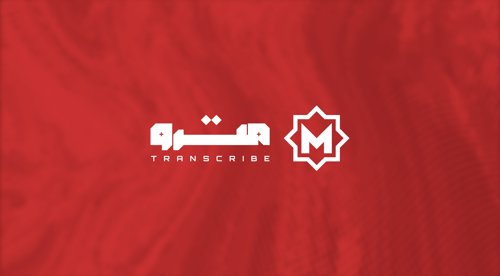

<p align="center">
  
</p>

<h1 align="center">Metro-ASR</h1>

<p align="center">
  <strong>Non-Autoregressive CTC-based Speech Recognition for Egyptian Arabic + English Code-Switching</strong>
</p>

<p align="center">
  <a href="#"></a>
  <a href="#"></a>
  <a href="#"></a>
  <a href="#"></a>
</p>

<p align="center">
  <a href="#features">Features</a> |
  <a href="#installation">Installation</a> |
  <a href="#quick-start">Quick Start</a> |
  <a href="#model-variants">Model Variants</a> |
  <a href="#fine-tuning">Fine-Tuning</a> |
  <a href="#beam-search--language-model">Beam Search & LM</a> |
  <a href="#deployment">Deployment</a> |
  <a href="#training-from-scratch">Training from Scratch</a>
</p>

---

## Features

- **Egyptian Arabic Focus** — Trained specifically on Egyptian dialect, not MSA
- **Code-Switching Support** — Handles Arabic-English mixing (e.g., "أنا رايح الـ meeting")
- **Blazing Fast on CPU** — Achieves **RTF < 0.002** on CPU (500x faster than real-time)
- **Non-Autoregressive** — Single forward pass, no autoregressive decoding loop
- **Optional Beam Search + LM** — KenLM 4-gram language model for improved accuracy
- **Scales from 26M to 1.4B parameters** — From on-device to server-grade
- **BPE & Character Tokenizers** — Choose based on your use case

---

## Installation

```bash
# Clone the repository
git clone https://github.com/MohammedAly22/Metro-ASR.git
cd Metro-ASR

# Create environment
conda create -n metro-asr python=3.10 -y
conda activate metro-asr

# Install PyTorch (CPU-only for inference)
pip install torch torchaudio --index-url https://download.pytorch.org/whl/cpu

# Or with CUDA for training
conda install pytorch torchaudio pytorch-cuda=12.1 -c pytorch -c nvidia -y

# Install dependencies
pip install -r requirements.txt

# (Optional) For beam search with LM
pip install pyctcdecode kenlm
```

---

## Quick Start

### Inference with Python

```python
import torch
import torchaudio
from metro_asr.utils.config import load_config
from metro_asr.model.metro import MetroASR
from metro_asr.model.tokenizer import build_tokenizer
from metro_asr.data.features import LogMelFeatureExtractor, resample_audio

# Load model
config = load_config("configs/metro_tiny.yaml")
tokenizer = build_tokenizer(config, "tokenizer_final")
model = MetroASR.from_config(config)

ckpt = torch.load("checkpoints/metro-tiny/best_model.pt", map_location="cpu", weights_only=False)
model.load_state_dict(ckpt["model_state_dict"])
model.eval()

# Extract features
feature_extractor = LogMelFeatureExtractor(
    sample_rate=16000, n_mels=80, n_fft=512, hop_length=160, win_length=400
)

waveform, sr = torchaudio.load("your_audio.wav")
waveform = waveform.mean(dim=0)
if sr != 16000:
    waveform = resample_audio(waveform, sr, 16000)

features = feature_extractor(waveform).unsqueeze(0)
lengths = torch.tensor([features.shape[1]])

# Transcribe
with torch.no_grad():
    log_probs, out_lengths, _ = model(features, lengths)
    decoded = model.decode_greedy(log_probs, out_lengths)
    text = tokenizer.decode(decoded[0])

print(text)
```

### Command-Line Inference

Edit the variables at the top of `scripts/inference.py`:

```python
AUDIO_PATH = "your_audio.wav"
CONFIG_PATH = "configs/metro_tiny.yaml"
TOKENIZER_DIR = "tokenizer_final"
DEVICE = "cpu"
```

Then run:

```bash
python scripts/inference.py
```

### Gradio Web Demo

```bash
python app.py
```

Opens a web interface at `http://localhost:7860` with:
- Audio upload or microphone recording
- Model size selection
- Greedy or Beam Search + LM decoding
- Real-time performance metrics (RTF, latency)

---

## Model Variants

Metro-ASR comes in 5 sizes. All models use the same Conformer architecture with different dimensions:

| Model | Parameters | d_model | Layers | Heads | Vocab | Status |
|-------|-----------|---------|--------|-------|-------|--------|
| **Metro-Tiny** | 26M | 256 | 12 | 4 | 600 (BPE) | Available |
| **Metro-Small** | 58M | 384 | 12 | 6 | 1,000 (BPE) | In Development |
| **Metro-Medium** | 238M | 512 | 24 | 8 | 2,000 (BPE) | In Development |
| **Metro-Large** | 710M | 768 | 32 | 12 | 4,000 (BPE) | In Development |
| **Metro-XLarge** | 1.4B | 1024 | 36 | 16 | 8,000 (BPE) | In Development |

### Performance (Metro-Tiny, CPU)

| Metric | Value |
|--------|-------|
| Inference RTF | ~0.002 (500x real-time) |
| Latency (10s audio) | ~20ms |
| Memory | ~100MB |
| Device | CPU (no GPU required) |

### Architecture

Metro-ASR uses a modern **Conformer** encoder with:

| Component | Description |
|-----------|-------------|
| **RoPE** | Rotary Position Embeddings — relative position encoding without positional tokens |
| **SwiGLU** | Gated feed-forward with SiLU activation (Macaron-style dual FFN) |
| **RMSNorm** | Pre-norm Root Mean Square normalization — faster than LayerNorm |
| **SE-Conv** | Squeeze-and-Excitation gated depthwise separable convolution |
| **Stochastic Depth** | Layer dropout that increases linearly with depth |
| **Intermediate CTC** | Auxiliary CTC loss at middle layers for better gradient flow |
| **CTC Head** | Linear projection → Log-Softmax (float32 for numerical stability) |

```
Audio (16kHz) → Log-Mel (80-dim) → Conv2d 4x Subsampling → N × Metro Blocks → CTC Head → Text
```

---

## Fine-Tuning

### Fine-Tune on HuggingFace Datasets

To fine-tune Metro-ASR on a HuggingFace dataset (e.g., code-switching data):

1. Edit `scripts/finetune.py`:

```python
CONFIG_PATH = "configs/metro_tiny.yaml"
TOKENIZER_DIR = "tokenizer_final"
PRETRAINED_CHECKPOINT = "checkpoints/metro-tiny/best_model.pt"

FINETUNE_DATASET = "MohamedRashad/arabic-english-code-switching"  # Any HF dataset
FINETUNE_LR = 1e-4
FINETUNE_MAX_STEPS = 50000
FREEZE_ENCODER_STEPS = 5000  # Freeze encoder initially, then unfreeze
```

2. Run:

```bash
CUDA_VISIBLE_DEVICES=0 python scripts/finetune.py
```

The script will:
1. Load the pretrained model
2. Freeze the encoder for the first 5,000 steps (trains only CTC head)
3. Unfreeze and fine-tune the full model with low learning rate
4. Save best checkpoint based on WER to `checkpoints/metro-tiny-cs-finetune/`

### Fine-Tune on Local Data

To use your own audio data, prepare it as a HuggingFace dataset on disk:

```python
from datasets import Dataset, Audio

# Your data as a list of dicts
data = [
    {"audio": "path/to/audio1.wav", "text": "transcription 1"},
    {"audio": "path/to/audio2.wav", "text": "transcription 2"},
    # ...
]

dataset = Dataset.from_list(data)
dataset = dataset.cast_column("audio", Audio(sampling_rate=16000))
dataset.save_to_disk("my_data_prepared/train")
```

Then set `PREPARED_DATA_DIR = "my_data_prepared"` in `scripts/finetune.py` and run.

### Fine-Tuning Tips

| Parameter | Recommended | Notes |
|-----------|-------------|-------|
| Learning rate | 1e-4 to 5e-5 | 10-20x lower than pretraining |
| Freeze encoder steps | 3,000–10,000 | Lets CTC head adapt before changing encoder |
| Max steps | 20,000–50,000 | Depends on dataset size |
| Batch size | 16–32 | Same as pretraining is fine |

---

## Beam Search & Language Model

Metro-ASR supports optional beam search decoding with a KenLM n-gram language model for improved accuracy, especially for code-switching.

### How the LM is Trained

The 4-gram KenLM is trained on text from multiple sources:

| Source | Samples | Purpose |
|--------|---------|---------|
| Egyptian Arabic transcripts | 500K | Core Arabic language patterns |
| [Prickly-Labs/1.9M-Egyptian-Corpus](https://huggingface.co/datasets/Prickly-Labs/1.9M-Egyptian-Corpus) | 500K | Extended Egyptian vocabulary |
| Code-switching transcripts (upsampled 20x) | 240K | Prevents English word deletion |
| English text (AG News) | 50K | English word coverage |

Training pipeline:
1. Collect text from all sources
2. Normalize and clean (Arabic normalization, allowed characters only)
3. Train 4-gram model with KenLM's `lmplz`
4. Build binary format for fast loading with `build_binary`

Output: `lm/lm_4gram.arpa` (text) and `lm/lm_4gram.bin` (binary, faster loading)

### Training the LM Yourself

```bash
python scripts/train_lm.py
```

Configurable at the top of the script:

```python
ORDER = 4              # N-gram order (4-gram recommended)
OUTPUT_DIR = "lm"      # Output directory
MAX_ARABIC_SAMPLES = 500000
MAX_CORPUS_SAMPLES = 500000
CS_UPSAMPLE_FACTOR = 20
```

### Using Beam Search for Inference

In `scripts/inference.py`:

```python
LM_PATH = "lm/lm_4gram.arpa"   # or lm_4gram.bin for faster loading
BEAM_WIDTH = 100                 # Number of hypotheses (higher = slower but better)
LM_ALPHA = 0.5                   # LM weight — how much to trust the language model
LM_BETA = 5.0                    # Word insertion bonus — prevents word deletion
```

### Parameter Guide

| Parameter | Range | Effect |
|-----------|-------|--------|
| **Beam Width** | 10–500 | More beams = better quality, slower. 100 is a good default |
| **Alpha (LM Weight)** | 0.0–3.0 | Higher = LM has more influence. Too high overrides acoustics |
| **Beta (Word Bonus)** | 0.0–10.0 | Higher = keeps more words. Increase if English words are dropped |

**Tuning tips:**
- If English words are being deleted → increase Beta (try 5.0–8.0)
- If output has too many insertions → decrease Beta
- If Arabic is garbled → decrease Alpha (LM may not cover those words)
- Use `TUNE_MODE = True` in `scripts/inference.py` to sweep Alpha/Beta automatically

### Greedy vs Beam + LM Comparison

| Method | Speed (RTF) | Accuracy | Best For |
|--------|-------------|----------|----------|
| Greedy | 0.0001 | Good | Real-time, pure Arabic |
| Beam + LM | 0.0015 | Better | Code-switching, offline |

Both are well under real-time on CPU.

---

## Deployment

### CPU Inference

Metro-ASR is designed to run efficiently on CPU. The Metro-Tiny model achieves:
- **~20ms** latency for 10 seconds of audio
- **RTF 0.002** — 500x faster than real-time
- **~100MB** memory footprint

No GPU required for production inference.

### ONNX Export

Export for cross-platform deployment:

```bash
python scripts/export_onnx.py
```

Edit at the top:
```python
CONFIG_PATH = "configs/metro_tiny.yaml"
CHECKPOINT_PATH = "checkpoints/metro-tiny/best_model.pt"
OUTPUT_PATH = "metro_tiny.onnx"
```

### Quantization (INT8)

After ONNX export, apply dynamic quantization:

```python
from onnxruntime.quantization import quantize_dynamic, QuantType

quantize_dynamic(
    "metro_tiny.onnx",
    "metro_tiny_int8.onnx",
    weight_type=QuantType.QInt8,
)
```

Expected: 2-3x additional speedup with < 1% WER degradation.

---

## Training from Scratch

### 1. Prepare Data

Downloads and merges all Egyptian Arabic datasets, creates train/eval/test splits:

```bash
python scripts/prepare_data.py
```

Creates:
- `data_prepared/train` — Training data
- `data_prepared/eval` — Validation data
- `data_prepared/test` — Curated test set (200 code-switching + 300 pure Arabic samples)

### 2. Train BPE Tokenizer

```bash
python scripts/prepare_final_tokenizer.py
```

Trains a SentencePiece BPE tokenizer on Egyptian Arabic + English text. Output: `tokenizer_final/bpe.model`

### 3. Train Language Model

```bash
python scripts/train_lm.py
```

Trains a KenLM 4-gram on Egyptian text + code-switching data. Output: `lm/lm_4gram.arpa`

### 4. Start Training

```bash
# Single GPU
CUDA_VISIBLE_DEVICES=0 python scripts/train.py --gpu 0

# Multi-GPU (DDP)
torchrun --nproc_per_node=4 scripts/train.py
```

### 5. Monitor with WandB

Training logs to [Weights & Biases](https://wandb.ai) automatically:

| Metric | Description |
|--------|-------------|
| `train/loss` | CTC loss (including intermediate CTC) |
| `train/blank_prob` | CTC blank probability (healthy: 0.3–0.7) |
| `train/grad_norm` | Gradient norm after clipping |
| `eval/wer` | Word Error Rate |
| `eval/cer` | Character Error Rate |

### Resume Training

Set in the config YAML:

```yaml
training:
  resume_from: "checkpoints/metro-tiny/checkpoint_step_60000.pt"
```

Or via environment variable for WandB continuity:

```bash
WANDB_RUN_ID="your_run_id" WANDB_RESUME="must" python scripts/train.py --gpu 0
```

---

## Datasets

Metro-ASR is trained on 8 datasets from HuggingFace:

| Dataset | Type | Description |
|---------|------|-------------|
| [AlaaSamir/custom-egy-tts](https://huggingface.co/datasets/AlaaSamir/custom-egy-tts) | Audio + Text | Egyptian Arabic TTS data |
| [OmarAhmedSobhy/egyption-with-emotion-dataset](https://huggingface.co/datasets/OmarAhmedSobhy/egyption-with-emotion-dataset) | Audio + Text | Emotional Egyptian speech |
| [MightyStudent/Egyptian-ASR-MGB-3](https://huggingface.co/datasets/MightyStudent/Egyptian-ASR-MGB-3) | Audio + Text | MGB-3 Egyptian broadcast data |
| [MAdel121/arabic-egy-cleaned](https://huggingface.co/datasets/MAdel121/arabic-egy-cleaned) | Audio + Text | Cleaned Egyptian Arabic |
| [MAdel121/Continuation-egy-for-ultravox-v1](https://huggingface.co/datasets/MAdel121/Continuation-egy-for-ultravox-v1) | Audio + Text | Extended Egyptian data |
| [Raniahossam33/Egyptian_TTS3RS](https://huggingface.co/datasets/Raniahossam33/Egyptian_TTS3RS) | Audio + Text | Egyptian TTS dataset |
| [ahmedbasemdev/egyptain-tts-dataset](https://huggingface.co/datasets/ahmedbasemdev/egyptain-tts-dataset) | Audio + Text | Egyptian TTS dataset |
| [MohamedRashad/arabic-english-code-switching](https://huggingface.co/datasets/MohamedRashad/arabic-english-code-switching) | Audio + Text | Arabic-English code-switching (12K samples) |

Additionally, the language model uses:
| Dataset | Type | Description |
|---------|------|-------------|
| [Prickly-Labs/1.9M-Egyptian-Corpus](https://huggingface.co/datasets/Prickly-Labs/1.9M-Egyptian-Corpus) | Text Only | 1.9M Egyptian Arabic sentences for LM training |

Total: **130K+ audio samples** for acoustic model training.

---

## Project Structure

```
Metro-ASR/
├── configs/                         # Model configurations
│   ├── metro_tiny.yaml              #   26M params (BPE-600)
│   ├── metro_tiny_char.yaml         #   26M params (Character)
│   ├── metro_small.yaml             #   58M params
���   ├── metro_medium.yaml            #   238M params
│   ├── metro_large.yaml             #   710M params
│   └── metro_xlarge.yaml            #   1.4B params
│
├── metro_asr/                       # Core library
│   ├── model/
│   │   ├── metro.py                 #   Full model (encoder + CTC head)
│   │   ├── encoder.py               #   Metro Encoder + Intermediate CTC
│   │   ├── attention.py             #   RoPE Multi-Head Self-Attention
│   │   ├── feed_forward.py          #   SwiGLU Feed-Forward
│   │   ├── convolution.py           #   SE-Gated Depthwise Conv
│   │   ├── subsampling.py           #   Conv2d 4x Subsampling
│   │   ├── decoder.py               #   CTC Beam Search + KenLM
│   │   └── tokenizer.py             #   Char & BPE Tokenizers
│   ├── data/
│   │   ├── dataset.py               #   Dataset loading & processing
│   │   ├── features.py              #   Log-Mel extraction
│   │   ├── augmentation.py          #   SpecAugment & Speed Perturbation
│   │   └── collator.py              #   Batch collation
│   ├── training/
│   │   ├── trainer.py               #   DDP Trainer
│   │   └── optimizer.py             #   AdamW + Cosine Schedule
│   └── utils/
│       ├── config.py                #   YAML config loader
│       └── logger.py                #   Logger
│
├── scripts/
│   ├── train.py                     # Training entry point
│   ├── finetune.py                  # Fine-tuning
│   ├── inference.py                 # Single-file inference
│   ├── batch_inference.py           # Batch inference
│   ├── prepare_data.py              # Data preparation
│   ├── prepare_final_tokenizer.py   # BPE tokenizer training
│   ├── train_bpe_tokenizer.py       # Alternative tokenizer training
│   ├── train_lm.py                  # KenLM language model training
│   ├── export_onnx.py              # ONNX export
│   └── diagnose.py                  # Training diagnostics
│
├── lm/                              # Language model files
├── tokenizer_final/                 # BPE tokenizer (bpe.model)
├── images/                          # README images
├── app.py                           # Gradio web demo
├── requirements.txt
└── README.md
```

---

## Next Steps

### Currently Available
- [x] Metro-Tiny (26M) — Character tokenizer, trained 300K steps
- [x] Metro-Tiny (26M) — BPE tokenizer, training in progress
- [x] Code-switching fine-tuning pipeline
- [x] KenLM beam search decoding
- [x] Gradio web demo (CPU)

### In Development
- [ ] Metro-Small (58M) — training
- [ ] Metro-Medium (238M) — training
- [ ] Metro-Large (710M) — training
- [ ] Metro-XLarge (1.4B) — training

### Planned
- [ ] ONNX export with optimized runtime
- [ ] INT8 / INT4 quantization for on-device deployment
- [ ] Knowledge distillation (large → small)
- [ ] HuggingFace model hub release
- [ ] HuggingFace Spaces demo
- [ ] Streaming / chunked inference for long audio
- [ ] Speaker diarization integration
- [ ] Mobile deployment (iOS / Android via ONNX)

---

## Citation

```bibtex
@software{metro-asr-2025,
  title  = {Metro-ASR: Non-Autoregressive CTC-based ASR for Egyptian Arabic and Code-Switching},
  author = {Mohammed Aly},
  year   = {2025},
  url    = {https://github.com/MohammedAly22/Metro-ASR}
}
```

## License

This project is for research purposes.
